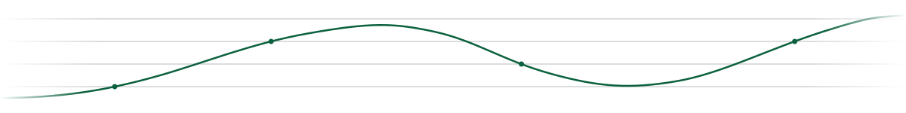

<picture>
  <source media="(prefers-color-scheme: dark)" srcset="assets/banner-dark.svg">
  
</picture>

### Ahmad Afzal

**Product Lead for Agent Fabric at [Open Innovation AI](https://openinnovation.ai).** I build AI platforms for organisations that cannot put their data in someone else's cloud: sovereign deployments, regulated industries, and the parts of the public sector where a data residency clause is the first question, not the last.

> Product Lead, AI Platforms &nbsp;·&nbsp; Sovereign and Regulated Enterprise AI &nbsp;·&nbsp; Abu Dhabi, UAE

<samp>
<a href="https://mahmadafzal.com">mahmadafzal.com</a> &nbsp;·&nbsp;
<a href="https://www.linkedin.com/in/mahfzal/">LinkedIn</a> &nbsp;·&nbsp;
<a href="mailto:mahmaddafzal@gmail.com">mahmaddafzal@gmail.com</a>
</samp>

#### What I'm building now

**Agent Fabric** is the platform: agents, the knowledge they work from, and the governance controls around both, built to run inside the customer's environment rather than beside it. **OI AI Security** is the other half of my remit, where I own product positioning for AI red teaming, guardrails, and runtime monitoring, mapped against the NIST AI RMF, the EU AI Act, and ISO 42001.

Most of my week is one question wearing different clothes: what does an enterprise need to see before it will let an agent act on its behalf?

#### No Lanes Product Management

> Lanes are where accountability goes to die.

- If it ships under my name it is mine: the spec, the demo, the threat model, the pricing page.
- Governance is a product surface, not a policy PDF filed after launch.
- Write the eval before the roadmap. A claim you cannot test is not a requirement.
- Sit with the user before you size the epic. Every shortcut past that costs a quarter.

#### Selected work

- **[ai-governance-checklist](https://github.com/mahfzal87/ai-governance-checklist)** &nbsp;·&nbsp; The intake triage, PRD template, and launch gate I use to take an AI feature from idea to release, structured on the EU AI Act, the NIST AI RMF, and ISO 42001.
- **[aigp-coach](https://github.com/mahfzal87/aigp-coach)** &nbsp;·&nbsp; A study system for the IAPP AIGP exam that diagnoses why you miss a question rather than just marking it wrong. Built for one user, which was me.

I also write about AI governance at [mahmadafzal.com](https://mahmadafzal.com).

#### Reach me

Follow the work here or on [LinkedIn](https://www.linkedin.com/in/mahfzal/). To actually reach me, [email is best](mailto:mahmaddafzal@gmail.com). I am always up for a conversation about governing AI in places where the rules are still being written.

---

This profile is text on purpose. No streak counters, no stats cards: commit volume is a poor proxy for product work.

